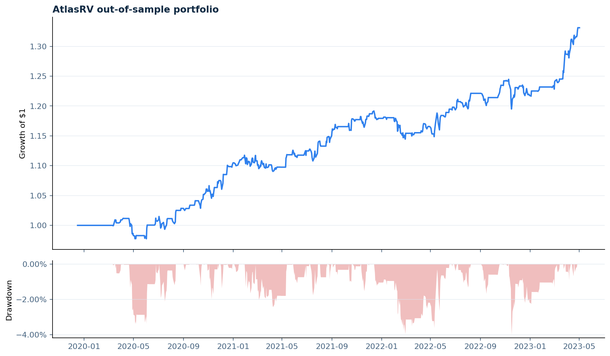

# AtlasRV

**A causal, regime-aware, cross-asset relative-value research platform.**

AtlasRV investigates temporary dislocations between economically linked instruments.
It combines statistical research, realistic execution assumptions, portfolio construction,
reproducible data artefacts, and production-style Python engineering. It is deliberately
multi-asset: equities, rates, credit, commodities, crypto, FX, and volatility can all use
the same research contract.

[Open the public real-data dashboard](https://louisgsln.github.io/AtlasRV/) · [Inspect the FRED study](docs/real-data-study/README.md)

> AtlasRV is research software and an interview portfolio project. Synthetic or
> historical results are not a claim of live profitability or investment advice.

## Why it stands out

Many pairs-trading examples fit one full-sample regression, optimise on the same
history, trade on the signal bar, and hide costs inside one arbitrary number.
AtlasRV makes each choice observable and testable.

| Layer | AtlasRV v0.2 |
|---|---|
| Economic research | Explicit thesis and asset-class metadata for every relationship |
| Statistical gate | Cointegration, ADF, half-life, Hurst, beta stability, and FDR q-values |
| Hedge models | Causal expanding OLS, rolling OLS, and dynamic Kalman regression |
| Information timing | Prior-window z-scores, next-bar execution, purged walk-forward tests |
| Execution | Commission, half-spread, slippage, quadratic impact, borrow, and financing |
| Portfolio | Correlation-adjusted inverse volatility, caps, optional vol target, effective bets |
| Regimes | Ex-ante high/low-volatility and up/down-trend attribution |
| Reproducibility | Canonical data snapshot with SHA-256 integrity manifest |
| Delivery | Typed package, CLI, tests, CI, Docker, release automation, Streamlit, and GitHub Pages |

## Research flow

~~~mermaid
flowchart TD
    A["Economic thesis"] --> B["Point-in-time data"]
    B --> C["Quality + SHA-256 snapshot"]
    C --> D["Diagnostics + FDR"]
    D --> E["Causal hedge model"]
    E --> F["Train / purge / test"]
    F --> G["Next-bar execution + costs"]
    G --> H["Correlation-aware portfolio"]
    H --> I["Regime attribution + reports"]
~~~

The core timing invariant is simple: a return can only be earned with information
available before that return begins. Regression tests perturb future prices and
assert that every earlier model state, signal, weight, cost, and return stays unchanged.

## Cross-asset universes

The deterministic universe is executable without credentials and includes:

- energy equities versus crude oil;
- copper miners versus copper;
- gold versus inflation-linked bonds;
- high-yield credit versus equities;
- banks versus a rates-curve proxy;
- one deliberate structural break that the research gate should reject.

The broader exploratory market config adds Treasury-curve, bitcoin futures-basis,
EURUSD/dollar-proxy, and volatility/equity relationships. Yahoo symbols are convenient
proxies, not institutional point-in-time data.

## Quick start

~~~bash
git clone https://github.com/Louisgsln/AtlasRV.git
cd AtlasRV
python -m venv .venv
source .venv/bin/activate
python -m pip install -e ".[dev]"
atlas-rv research   --provider synthetic   --config configs/universe.yml   --output reports/research
~~~

Windows activation:

~~~powershell
.venv\Scripts\Activate.ps1
~~~

The unified research command defaults to purged walk-forward evaluation. Add
**--full-sample** only for diagnostics, never for a headline out-of-sample claim.

## Compare hedge models

~~~bash
atlas-rv compare-models   --provider synthetic   --config configs/universe.yml   --pair oil_energy   --output reports/model_comparison.csv
~~~

The signal, thresholds, execution, and costs remain identical. Only the estimator
changes, making the comparison interpretable.

## Real-data multi-asset stress study

FRED provides public observed series without credentials. The tracked study spans
equity, rates, credit, FX, crypto, commodity, and volatility relationships:

~~~bash
atlas-rv research \
  --provider fred \
  --config configs/fred_market_study.yml \
  --start 2021-01-01 \
  --output reports/fred_market_study
~~~

All eight hypotheses remain visible in diagnostics, but only relationships that pass
the research gate enter the headline portfolio. Several FRED inputs are indices,
yields, spreads, or reference levels rather than executable total-return instruments.

## Explore market-data proxies

~~~bash
python -m pip install -e ".[data]"
atlas-rv research   --provider yahoo   --config configs/market_universe.yml   --start 2015-01-01   --output reports/market_universe
~~~

For serious research, replace the optional Yahoo adapter with licensed,
point-in-time futures chains, bonds, options, or intraday data while preserving
the MarketDataSource interface.

## Research bundle

~~~text
reports/research/
├── research_report.md
├── research_report.html
├── summary.json
├── diagnostics.csv
├── pair_metrics.csv
├── regime_metrics.csv
├── regimes.csv
├── portfolio.csv
├── portfolio_weights.csv
├── portfolio_class_allocations.csv
├── portfolio_equity.png
├── pair_zscores.png
├── data_snapshot/
│   ├── prices.csv
│   └── prices.manifest.json
├── pairs/
└── walk_forward_folds/
~~~

The manifest records shape, symbols, dates, and the exact SHA-256 hash of canonical
input bytes. A modified snapshot fails integrity validation.

## Dashboard

The latest public static dashboard is deployed at
[Louisgsln.github.io/AtlasRV](https://louisgsln.github.io/AtlasRV/). It is rebuilt
from the current FRED snapshot only after the full validation suite passes.

For the deeper local Streamlit explorer:

~~~bash
python -m pip install -e ".[dashboard]"
streamlit run dashboard/app.py
~~~

The dashboard exposes portfolio equity, drawdown, sleeve allocation, asset-class
mix, realised correlations, research-gate decisions, pair signals, cost attribution,
regime performance, and the data-integrity manifest.

## Docker

~~~bash
docker build -t atlasrv .
docker run --rm -v "$PWD/reports:/app/reports" atlasrv
~~~

## Quality gates

~~~bash
ruff check src tests
mypy src
pytest
python -m build
twine check dist/*
~~~

The suite covers:

- future-price perturbation and causal invariance;
- Kalman tracking and both causal OLS estimators;
- stateful entries, exits, stops, and cooldown;
- exact gross-to-net cost reconciliation;
- purged and disjoint out-of-sample folds;
- FDR correction and structural-break rejection;
- correlation-aware concentration caps;
- causal regime labels;
- deterministic snapshot hashes and tamper detection;
- report serialization and data-store round trips.

## Architecture and methodology

- [Architecture](docs/architecture.md)
- [Methodology and information timing](docs/methodology.md)
- [v0.2 design notes](docs/v0.2.md)
- [Reproducible synthetic results](docs/demo-results.md)
- [Interview guide](docs/interview-guide.md)
- [Real-data study protocol](docs/real-data-study/README.md)
- [GitHub portfolio checklist](docs/github-profile.md)

## Thirty-second interview pitch

> AtlasRV is a cross-asset relative-value research platform I built in Python.
> It compares three causal hedge-ratio models, controls multiple testing, selects
> parameters through purged walk-forward folds, applies next-bar execution with
> explicit two-leg costs, and combines approved sleeves using lagged volatility
> and correlation. Every run produces auditable data, risk, regime, and reporting
> artefacts, and the tests actively prove that changing the future cannot alter
> the past.

## Honest limitations

- Proxy data mix trading hours and can conceal basis and roll effects.
- Linear-plus-quadratic costs are calibrated assumptions, not an order-book simulator.
- FDR control reduces false discoveries but cannot remove selection bias.
- Daily data cannot model intraday liquidity, latency, or partial fills.
- Regimes are descriptive state labels, not forecasts.
- A stable historical relationship can still fail economically.

## License

MIT. See [LICENSE](LICENSE).
