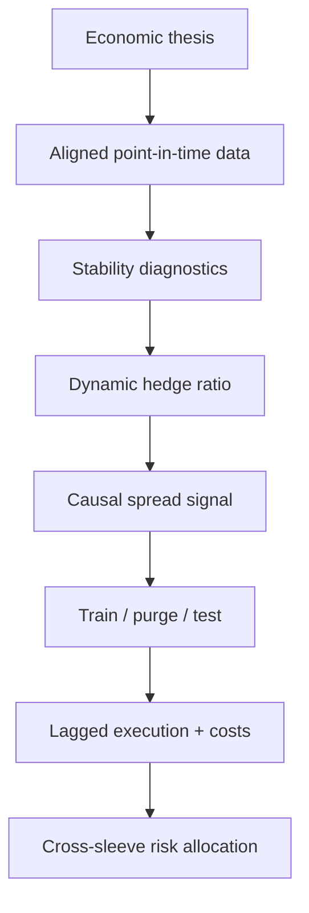

# AtlasRV

[](https://www.python.org/)
[](https://github.com/Louisgsln/AtlasRV/actions/workflows/ci.yml)
[](LICENSE)

**A regime-aware, cross-asset relative-value research and backtesting lab.**

AtlasRV tests whether temporary dislocations between economically linked assets
survive causal modelling, walk-forward selection, execution lags, trading costs,
and portfolio risk controls. It is a research system—not a collection of chart
patterns and not a claim of live profitability.


The exact held-out metrics and the deliberately rejected relationship are shown
in [Reproducible demo results](docs/demo-results.md).

## Why this project exists

Most pairs-trading demos fit a static regression on a full dataset, optimise a
threshold on the same history, trade on the signal bar, and omit two-leg costs.
AtlasRV makes those assumptions explicit and testable.

The project demonstrates three complementary skills:

- **markets:** economic hypotheses spanning equities, rates, credit, and commodities;
- **research:** cointegration diagnostics, dynamic hedge ratios, regime failure,
  purged walk-forward testing, and honest limitations;
- **engineering:** typed package architecture, provider interfaces, CLI, tests,
  CI, reproducible artefacts, and an optional dashboard.

## Default research universe

| Relationship | Asset classes | Economic link |
|---|---|---|
| Energy equities / crude oil | Equity / commodity | Shared oil cash-flow driver |
| Copper miners / copper | Equity / commodity | Operating leverage to the metal |
| Gold / inflation-linked bonds | Commodity / rates | Real-rate and inflation sensitivity |
| High-yield credit / equities | Credit / equity | Claims on common corporate balance sheets |
| Banks / curve proxy | Equity / rates | Earnings sensitivity to the rate regime |

The reproducible demo generates deterministic versions of these relationships.
One pair contains a deliberate structural beta break so the research gate does
not approve everything it sees.

## Research flow



Key safeguards:

- one-step Kalman innovations rather than fitted full-sample residuals;
- z-score history ending at `t-1`;
- targets formed at close `t` applied to return `t → t+1`;
- explicit turnover across both legs;
- rolling train/purge/test parameter selection;
- volatility estimates shifted before portfolio allocation;
- future-perturbation regression test for look-ahead leakage.

The equations and timing convention are documented in
[Methodology](docs/methodology.md).

## Quick start

```bash
git clone https://github.com/Louisgsln/AtlasRV.git
cd AtlasRV
python -m venv .venv
source .venv/bin/activate  # Windows: .venv\Scripts\activate
python -m pip install -e ".[dev]"
atlas-rv demo --output reports/demo
```

The command produces:

```text
reports/demo/
├── research_report.md
├── summary.json
├── diagnostics.csv
├── pair_metrics.csv
├── portfolio.csv
├── portfolio_weights.csv
├── portfolio_equity.png
├── pair_zscores.png
├── pairs/
└── walk_forward_folds/
```

## Run with market-data proxies

The optional Yahoo adapter is provided for experimentation—not for institutional
research claims.

```bash
python -m pip install -e ".[data]"
atlas-rv download \
  --symbols "XLE,CL=F,COPX,HG=F,GLD,TIP,HYG,SPY,KBE,SHY" \
  --start 2015-01-01 \
  --output data/cache/yahoo_proxies.csv

atlas-rv run-csv \
  --prices data/cache/yahoo_proxies.csv \
  --config configs/yahoo_proxies.yml \
  --output reports/yahoo_proxies
```

For serious work, replace this adapter with licensed, point-in-time futures,
bond, options, or intraday data while keeping the same `MarketDataSource`
contract.

## Optional dashboard

```bash
python -m pip install -e ".[dashboard]"
streamlit run dashboard/app.py
```

## Architecture

```text
src/atlas_rv/
├── data/        # sources, quality gates, cache, deterministic universe
├── models/      # sequential dynamic regression
├── signals/     # causal standardisation and trade state machine
├── backtest/    # next-bar execution and walk-forward evaluation
├── research/    # cointegration, half-life, Hurst, stability
├── risk/        # metrics and cross-sleeve allocation
├── reporting/   # charts and reproducible research bundle
└── cli.py
```

## Quality checks

```bash
ruff check src tests
mypy src
pytest
```

The test suite covers causal invariance, Kalman tracking, stateful entries and
stops, transaction-cost attribution, purged folds, structural-break rejection,
data-store round trips, and concentration-capped allocation.

## Interview material

[Interview guide](docs/interview-guide.md) contains a 30-second pitch, a
two-minute walkthrough, likely technical questions, design trade-offs, and
weaknesses worth volunteering.

## Disclaimer

AtlasRV is educational research software. Synthetic and historical results do
not represent future performance, investment advice, or an executable strategy.
