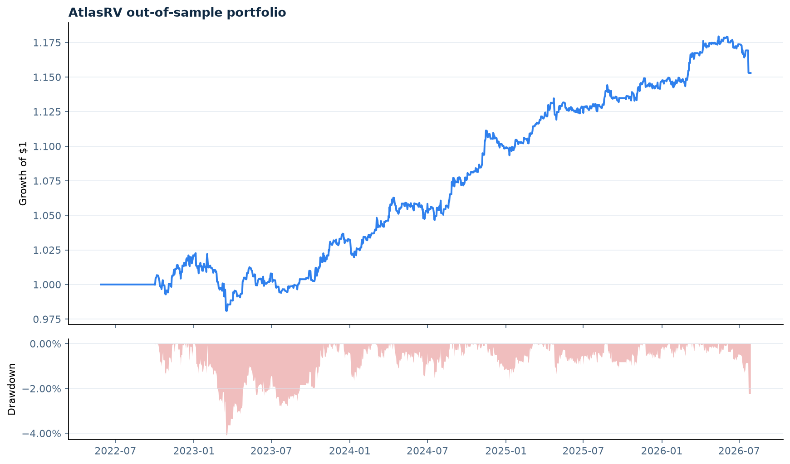

# AtlasRV research report

> Dataset: **FRED public observed series (real-data stress study; research gate enforced)**. Historical and synthetic results are not a live
> trading claim or investment advice.

## Executive summary

- Out-of-sample Sharpe: **0.86**
- Annualized return: **2.38%**
- Annualized volatility: **2.79%**
- Maximum drawdown: **-4.08%**
- Average effective bets: **2.50**
- Research gate: **5/8 relationships traded**

## Relationship diagnostics

| Pair | Coint p | FDR q | Half-life | Hurst | Beta instability | Gate |
|---|---:|---:|---:|---:|---:|:---:|
| wti_brent | 0.0000 | 0.0000 | 7.8d | 0.25 | 0.6% | PASS |
| treasury_2y_1y | 0.0000 | 0.0000 | 15.6d | 0.36 | 13.3% | PASS |
| sp500_dow | 0.0189 | 0.0302 | 50.1d | 0.45 | 13.3% | PASS |
| nasdaq_sp500 | 0.1480 | 0.1480 | 151.5d | 0.51 | 36.9% | REVIEW |
| euro_sterling | 0.0258 | 0.0343 | 47.2d | 0.34 | 33.1% | PASS |
| hy_ig_credit | 0.0004 | 0.0010 | 16.2d | 0.20 | 10.0% | PASS |
| vix_curve | 0.0801 | 0.0915 | 14.1d | 0.18 | 3.8% | REVIEW |
| bitcoin_ether | 0.0150 | 0.0300 | 70.7d | 0.50 | 83.7% | REVIEW |

## Methodology

1. Register an economic thesis before testing the relationship.
2. Control the universe-level false-discovery rate.
3. Estimate a causal Kalman, rolling OLS, or expanding OLS hedge ratio.
4. Standardize one-step errors against history ending yesterday.
5. Select parameters on rolling train/purge/test folds.
6. Apply next-bar weights and explicit spread, impact, borrow, and funding costs.
7. Allocate sleeves with lagged volatility and correlation penalties.
8. Attribute performance to regimes classified only with prior information.

## Reproduction and integrity

- Data checksum: 294498c9d691064ccaa130f494e5c95054f63f0134c01de00440a24e0086e83a
- Machine-readable results: summary.json
- Interactive report: research_report.html

Reproduce with:

    python -m pip install -e '.[dev]'
    atlas-rv research --provider synthetic --config configs/universe.yml --output reports/research
